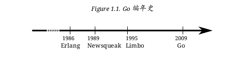

# 简介

> “对此感兴趣,并且希望做点什么。”  
> 在为 Go 添加复数支持时  
> **KEN THOMPSON**

什么是 Go?来自其网站 [17] 的介绍:

Go 编程语言是一个使得程序员更加有效率的开源项目。 Go 是有表达力、简洁、清晰和有效率的。它的并行机制使其很容易编写多核和网络应用,而新 的类型系统允许构建有 性的模块化程序。Go编译到机器码非常快速,同时具有便利的垃圾回收和强大的运行时反射。它是快速的、静态类型编译语言,但是感觉上是动态类型的,解释型语言。

Go 1 是 Go 语言的第一个稳定发布版本。本文档的所有练习都工作于 Go 1 – 如果不能工作,那就一定是 bug。

本书使用了下面的约定:

* 代码用 DejaVu Mono 显示;
* 关键词用 DejaVu Mono Bold 显示;
* 注释用 DejaVu Mono Italic 显示;
* 代码中额外的标记, ← 用这种形式展现;
* 使用数字 1. 标记长内容 – 解释会跟随其后;
* 行号在右边展示;
* Shell 示例用 % 作为标记;
* 强调的段落会缩进,在左边有竖线。

## 官方文档

Go已经有大量的文档。 例如 Go Tutorial [16] 和 Effective Go [11]。网站 <http://golang.org/doc/> 也是绝佳的起点。虽然并不一定要阅读这些文档,但是强烈建议这么做。

>在互联网上搜索 时, 应 当 使 用“golang” 这 个 词 来代替原始的 “go”。

Go 1 通过叫做 go doc 的标准程序提供其文档。如果你想了解内建相关(参阅下一章 “运算符和内建函数” 小节)的文档,可以像这样获取:

	% go doc builtin

> 在第 4 章解释了如何构造你自己的包的文档。

## 前身

Go的前身来自于 Inferno[^2]\(基 于 Plan 9[3] 的 改 造\)。 Inferno 包 含 了 一 个 叫做 Limbo[4] 的语言。这里引用了一段来自于 Limbo 论文的描述:

> Limbo是用于开发运行在小型计算机上的分布式应用的编程语言。它支持模块化编程,编译期和运行时的强类型检查, 进程内基于具有类型的 channel 通讯,原子性垃圾收集,和简单的抽象数据类型。它被设计用于即便是没有硬件内存保护的小型设备上,也能安全的运行。

Go 从 Limbo 继承的另一个特性是 channel(参阅第 7 章)。从 Limbo 文档来的另一段描述:

> [channel] 是用于向系统中其他代理发送和接收特定类型对象的通讯机制。channel 可以用于本地进程间通讯;用于连接到命名的目的地的库方法。两种情况都是直接发送和接收操作的。

channel 在 Go 中比在 Limbo 中更加好用。如果我们对 Go 的历史深入探索,会发现一个指向 “Newsqueak[25]” 的线索,这是在类 C 语言中使用 channel 进行通讯的先驱。channel 并不是这些语言独有的,另一个非类 C 语言:Erlang[7],也在使用它。

使用 channel 与其他进程进行通讯叫做 “通讯序列化过程(Communicating Se-quential Processes - CSP)”,由 C. A. R. Hoare[24] 设计构想,而他正是那个发明快速排序 [23] 算法的人。

> Go是第一个实现了简单的(或更加简单的)并行开发,且跨平台的类 C 语言。

## 获得 Go

在这一节中将介绍如何在本地设备上安装Go。也可以在线上<http://play.golang.org/>编译Go代码,这是最为便捷的快速体验的方法。也可以从网站[18]获得已经编译好的二进制版本。

### linux 

Ubuntu 和 Debian 在其仓库中都有 Go包,可以查找 “golang” 包进行安装。但是工作的时候可能会有一些小问题。所以这里仍然使用源码进行安装。

手工从 mercurial 中获取 Go 代码并且编译。对于其他类 Unix 系统,过程类似。

首先安装 Mercurial(获取 hg 命令)。在 Ubuntu/Debian/Fedora 需要安装包 
: mer-curial

为了编译 Go 需要包
: bison,gcc,libc6-dev,ed,gawk,make;

设置环境变量 GOROOT 作为 Go 的安装目录:
:	% export GOROOT=~/go

然后获取 Go 最新的发布版(=Go 1)源代码:
:	% hg clone -r release https://go.googlecode.com/hg/ $GOROOT

设置 PATH 指向到 Go 的二进制文件所在目录,这样就可以让 Shell 找到它们
:	% export PATH=$GOROOT/bin:$PATH

编译 Go 
:	% cd $GOROOT/src
:	% ./all.bash

如果全部都没问题,你最终会看到下面的内容:

	+--- cd ../test
	+0 known bugs; 0 unexpected bugs
	+
	+ALL TESTS PASSED
	+
	+---
	+Installed Go for linux/amd64 in /home/go
	+Installed commands in /home/go/bin

### 在 Windows 下获得 Go
最好的方式仍然是遵循网站 [18] 的介绍,为了方便重复如下。

* 下载 Go 1: http://code.google.com/p/go/downloads/list?q=OpSys-Windows+Type%3DArchive;
* 解压缩到 C:\ 盘;
* 确保内容在 C:\Go。注意:在解压缩 zip 文件时,这个目录会被创建;
* 添加 C:\Go\bin 到 $PATH:
	`set PATH=%PATH%;C:\Go\bin`

##练习

Q1. (1) 文档

1. Go 的文档可以通过 go doc 程序阅读,它包含在 Go 的发布包中。

go doc hash 给出了 hash 包的信息:

	% go doc hash
	PACKAGE
	package hash
	...
	...
	...
	SUBDIRECTORIES
		adler32
		crc32
		crc64
		fnv

哪个 go doc 的命令可以显示 hash 包中的 fnv 文档?

## 答案

A1. (1) 文档

1. fnv 包在 hash 的子目录中,所以只需要go doc hash/fnv 即可。

也可以指定 “Go 手册” 中某个函数的的文档。例如,函数 Printf 在 fmt 包中,仅阅读这个函数的文档,使用:go doc fmt Printf。

所有的内建函数同样可以通过 godoc 程序访问:

	go doc builtin。
