# 围棋入门教程

<http://weiqi.sports.tom.com/secondary/wskt/wskt_index.htm>

## 第一课 浅说围棋

中国古代的四大艺术，琴棋书画，历史悠久，源远流长。 其中的棋，说的就是围棋。

围棋艺术，千变万化，具有经久不衰的魅力，这是它流传几千年至今受到人们喜爱的原因。

围棋作为一门科学，它可以最大限度地开发智力，启迪思维，锻炼头脑，陶冶情操。在围棋的对弈中，包含着形象思维、逻辑思维的创作。它能增强机械记忆和理解记忆，它能提高人们的计算本领。

围棋是中国的传统棋种，早在春秋战国时期就广为流传。每一朝代都涌现出许多才华出众的围棋高手，流传着许多动人优美的围棋史话。这些，都是我国古代劳动人民智慧的结晶。

中华人民共和国成立以后，围棋被列为体育竞赛项目，并于1957年起举行全国性的围棋锦标赛，先后涌现出了一批优秀围棋手。他们在国际、国内比赛中不断取得优异成绩，其中有代表性的是陈祖德和聂卫平两位棋手。

陈祖德九段，是六十年代中国围棋的巨匠，称霸中国棋坛十多年之久，是首次在对子条件下战胜日本九段的棋手，是驰名中外的“中国流”布局的主要创造者，著有许多价值极高的围棋学术著作，虽然近些年来因病退下比赛第一线，但是，他对中国的围棋事业所做出的贡献是巨大的。陈祖德同志现任中国围棋协会的主要负责人。

聂卫平九段，是全国人民众所周知的体坛名星，他多次战胜日本的“超一流”九段。在中日围棋擂台战上力挽狂澜，连连挫败小林光一九段、藤泽秀行九段、武宫正树九段、加藤正夫九段，等一系列日本围棋高手，为祖国争得了荣誉。1983年获国家体委颁发的“体育荣誉奖章”，现在被授予“棋圣”称号，现任国家围棋队主教练，聂卫平的成功，把我国围棋水平推向了一个全新的阶段。

我们国家的围棋人口有数千万之多，而且有明显上升的趋势。但职业棋手只有二百人左右，什么叫职业棋手呢？职业棋手也称“专业棋手”，凡是以下棋为职业，服务于各围棋组织或体育代表队，在围棋技术上受过正规训练，有相当强的围棋功底，经常参加国内外重大比赛的棋手都称职业棋手。

除专业棋手，以业余时间从事围棋活动的棋手或棋艺爱好者都叫“业余棋手”。他们的主要特点是：一般不以围棋为主要职业，没有受过（或仅受过暂短时间）正规训练，通常不参加专业棋手的比赛。

不论是职业棋手还是业余棋手，怎样才能测量他们棋力的高低呢？在中国和日本以及欧美的围棋界里，现在都实行“段位制度”和“级位制度”。段位的高低是一个棋手棋艺水平的重要标志，我国的段位共分九个等级，依实力的高低从九段排至一段，九段为最高。一段也叫初段。获得初段的称号，说明棋艺达到一定的水平，大至说来九段的棋力要让初段两、三子左右，以上所说指的是专业段位。

除专业段位外还有业余段位，业余段位是按照业余棋手的棋力水平所评定的等级。目前我国最高业余段位六段，同专业段位相比较，与同等级的业余段位棋手艺水平相差甚远。据统计，专业初段棋手实力同业余五六段的棋手实力旗鼓相当。业余段位以下称“级”，级也分九个等级。与段位不同的是级数越大棋力越低，以一级为最高。

以上是对围棋的历史、著名的棋手、围棋段级位等级的简单介绍。在不懂围棋的人看来围棋似乎很深奥，很神秘，其实并不是这样，围棋是非常易学的。只要读者认真理解本教程的内容，完成练习题材的内容，完成练习题，就会逐步掌握围棋的基本要领，循序渐进，认真对局定将会成为一名相当不错的棋手。
 

我们接下来介绍围棋的棋具：棋盘、棋子、计时钟。在正规比赛中，这三样是不可缺少的，但一般的对局只需棋盘和棋子。

围棋棋盘：形状为正方形或略呈长方形的平面图，现在的棋盘为平面上画横竖各十九条平行线，构成三百六十一个交叉点。

为了便于判定棋盘上各点的位置，采用座标法进行编号，横线自上而下用汉字依次编为第一……十九路，竖线从左至右用阿拉伯数字编第1……19路。记录、说明或教学的时候均以先竖后横的次序为准。

例如：图一中的A点：5．十路交叉点；B点：10．十一路……等等。

图一

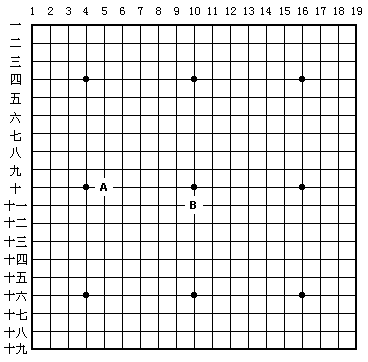

需要说明的是，在一般的棋盘上和正式比赛中的棋盘上都没有数字标记，图一中的数字只是在棋谱中为便于说明着子点或为方便易查而标明的。
棋盘上可分为九个部分，分别称为：左上角、左下角、右上角、右下角、上边、下边、左边、右边和中腹（见图二）。

图二

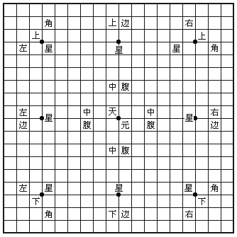

棋盘上共有九个黑点称作“星”，棋 心的黑点称作“天元”，“天元”并没有其他特殊意义。

棋盘上的九个部分只是大致的划分，并没有严格的界限，在这里只作笼统的说明。棋子下在星位上或天元上与棋的内容和规则都没有直接关系。“星座”与“天元”只是棋盘的标位。

棋盘的每条边线叫做第一线（或一路），紧靠第一线的那条线叫第二线，再向中腹移动依次称为第三线（三路）第四线（四路）等等。

一般简易的棋盘可用硬纸或塑料制成，但比赛用的正规棋盘都是木料制品。

围棋的棋子：围棋的棋子分黑白两种颜色，形状为圆形。正式比赛的棋子黑方一百八十一枚，白方一百八十枚。围棋的棋盘交叉点三百六十一处，两色的棋子相加应该等于这个数字。棋盘与棋子的关系最为密切，这个问题较为复杂，在这里首先明确概念，以后再作说明。
一般用的棋子其数量并没有非常精确的数字规定，各色棋子一百六十枚到一百七十枚左右即够用，多点少点关系不大。

### 思考题：

1. 为什么说围棋可以开发智力，又能启迪思维？
2. 为什么说围棋既是一门艺术，又是一门科学？
3. 新中国成立后，最具有代表性的棋手是哪两位？他们对围棋的主要贡献是什么？
4. 用什么来测量棋手的棋艺水平？
5. 职业棋手与业余棋手有什么区别？业余段位与专业段位的棋力如何进行比较？
6. 整个棋盘主要分哪几个部分？

## 第二课 行棋规则与胜负计算

围棋的基本规则规定：对局者一方执黑子先行（让子棋除外），另一方执白子，双方轮流交替下一子到棋盘的交叉点上（已有棋子的交叉点不能下子，禁着点不能下子），棋子下定后不允许再挪动位置。这一点同中国象棋和国际象棋有着根本的区别。
在双方行棋的过程中，运用吃子、打劫、作活、围地等技术直至终局，所谓终局就是棋盘上每一个交叉点的归属均已完全确定下来。
围棋对局中正确的拿子方法是：用食指和中指的指尖夹住棋子，准确地将棋子轻轻放在棋盘的交叉点上，业余棋手当中，有些人习惯于用拇指和食指夹住棋子，这种姿势很不正确，不能登大雅之堂。请看下图；

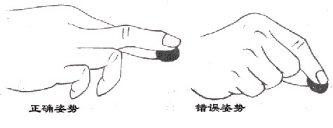

按照行棋的规则：由黑棋先走，黑1占右上角，白2占左下角，黑3占左上角，白4占右下角，黑5攻击白4，双方一替一手的应接直至白18，这就是所谓的下围棋。请看图一。

图一

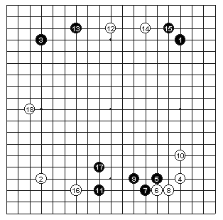
 

棋至终局后，怎样计算胜负呢？怎样判定谁输谁赢呢？简单地说围棋中的胜负可以概括为：谁围的地域大谁就是胜者；反之，就是败者。
围棋盘上共有三百六十一个交叉点，一盘棋的胜负就是由对局双方所占据的交叉点的多少所决定的。更精确地说就是由双方活棋所占据的地域的大小来决定的。一个交叉点为一子，每方以一百八十又二分之一子为归本数，超过此数者为胜，不足此数者为负。

图二

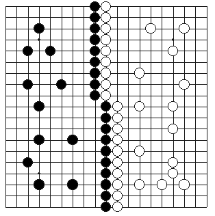
 

 
如图二所示黑方占据了棋盘上左边的地域，白方则占据棋盘上右边的地域（实际上真正的对局是不会下成这样的），因为双方已把棋盘上所有的交叉点都各自占有，没有余下任何可争夺的地域，这盘棋可以计算胜负了。

### 一、分先

指双方棋艺水平旗鼓相当，由双方轮流执黑先走。按我国现行的围棋规则规定，由于黑棋先走，有一定的先手威力，应由执黑的一方贴出2（3／4）子。所以黑所占的地域必须超过183（1／4）子（180 （1／2）＋2（3／4））才能取胜。比如黑棋数出来有185个子，即黑棋1（3／4）子。而白方的地域只要超过177（3／4）子（180（1／2）－2（3／4））即可获胜。在国际与国内的各种正规化比赛中，都采用分先规则。

 

### 二、让先

 

指水平略低的一方执黑先走，终局计算时不贴子。即各占180（1／2）子为和棋，哪一方超过180（1／2）即可取胜。非正式比赛或民间对局也采用此规则。让先规则运用于双方棋艺水平有一定差距的棋手之间的对局。

 

### 三、让子

 

让子是棋艺水平有较大差距的对局双方所采用的对局形式之一，为了取得棋力的相互平衡，由水平低的一方执黑在棋盘的指定位置上连续放置若干黑子（水平差距大的子数增多，差距小的子数相对减少）。不同的让子数有不同的放子规定，对初学者， 具有专业水平的棋手可让二十五子，见图三。

图三

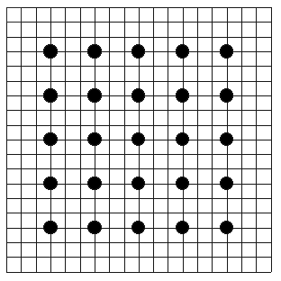
 

图三的这种情况，终局后黑方须贴还白方12（1／2）子，贴还后仍以各占180（1／2）子为和棋。

 
初学者水平有一定提高之后，可相对减少让子的子数，图四便是让十六子的图形，待终局后黑方须贴还白方八子。贴还后仍以各占180（1／2）子为和棋，多者算胜，为者为负。图五是让十三子的图形。终局后，黑方须贴还白方6（1／2），贴还后仍以各占180（1／2）子为和棋，多者算为胜，为者为负。图五是让十三子的图形。

图四 

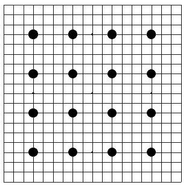

图五
 
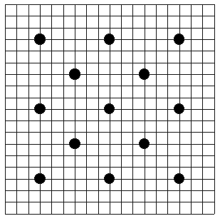

终局后，黑方须贴还白方6（1／2）子，贴还后仍以各占180（1／2）子为和棋，多者为胜，少者为负。
以上各图举的例子是为了便于读者按照规则授子，因为让子较多，很多子不在星位上，被授的棋子在棋盘上要力求对称。
从前面的图形不难看出，让子棋中，黑方贴还白方的子数等于所授子数的1／2，这便是让子棋中计算胜负的方法。

下面以具体例子详细介绍终局时数棋的方法如图六。

图六
 
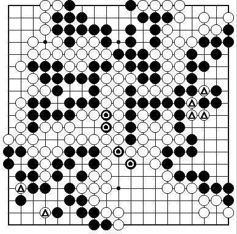

这是日本著名棋手桥本昌二九段执黑对坂田荣男九段执白的一局棋。图六是这盘棋终局的图形，棋盘上所有的交叉点已被双方各自占有。怎样来计算胜负呢？

首先把双方的死子拿掉，死子即在双方各自的包围中没有活力的棋子。如果做黑棋，就把黑势力中划有△点的白死子拿出去，因为这些子已经没有价值了。

其次，把一方（其实可以任选一方）的地域用棋子填满，只要数一数，便知胜负了。

图七
 
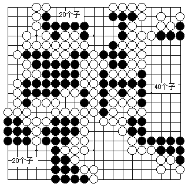
 

为了简明起见，一般是把小块填满，把大块的地域做成整数，这样就不必把整个棋子都填到棋盘上了，这种整块做棋的方法，较为实用。民间对局和比赛中都采用这种方法，如图七所示。围棋规则中规定：在三百六十一个交叉点中，谁如果所占的地域超过了180（1／2）子以上谁就算胜利，现代比赛有黑贴目的规定，所以黑地域须超过183（1／4）子才算获胜。而少于这个数字就算失败。所谓黑胜几子、白胜几子就是根据这个规则来确定的。

图七中的形状，是为了便于“做棋”而把散落的图形整齐化，右侧做了四十个子，上方做了二十个子，左下方又做子二十个子，加起来共八十个子，那么除去白棋围空中的黑死子外，盘面剩下的黑子加上八十个做完的“空”，就是黑子的总数，这种方法，就是实战后或比赛后，所采用的计算胜负的方法。一般的民间对弈也采用这种方法计算胜负。

当然，初学者还不能掌握各种比赛规则所采用的计算胜负的方法，因为在比赛中（分先对局），各种方法对黑方先行的效率都要往回贴目，而这种贴目的形式都各有不同。比如中国围棋协会的规则和日本规则、台湾应氏规则都有不同之处，很大的分歧点是黑方先行后贴目的具体数字不同，这些都比较复杂，不便在此说明，读者只要大概明白就可以了。但有一个基本概念必须清楚，那便是要想取得对局的胜利，就必须占有全盘交叉点的一半以上，初学者对这个问题一定要掌握。

### 思考题

1．什么叫终局？
2．在对局下至什么情况下，开始计算胜负？
3．黑白双方各在什么的情况下算胜？
4．本课介绍多少种不同水平棋手下棋的授子方式？并简单说明一下。
5．计算这盘棋的胜负。见下图：

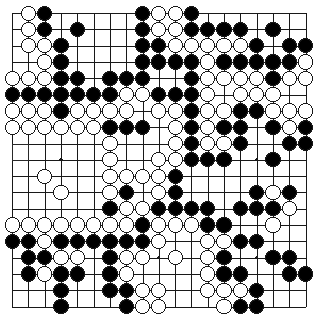

## 第三课 围棋中如何吃子

在围棋对局中，棋子在棋盘上是依赖“气”来生存的，若想学会如何吃子就必须先了解“气”。“气”是围棋基本术语之一，是指在棋盘上与棋子紧紧相邻的空交叉点，见图一。

图一

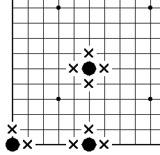

图中角上的一子与它紧紧相领的有两个交叉点，所以它有两气。 边上的一子，与它紧紧相邻的有三个空交叉点，所以它有三气，中腹的一子，与它紧紧相邻的空交叉点有四个，所以它有四气。棋盘上单独一个棋子的气数不可能超过四气，但两个或两个以上相连的棋子则不同了。

图二

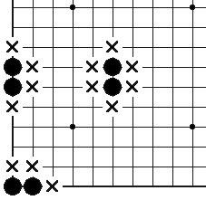
 

如图二；角上的二子，有三气，边上的两子有四气，中腹的两子有六气。 从以上的例子可以看出，棋子的气数要受棋子在棋盘上位置的影响。位于中腹的棋子气数较多，边上和角上的棋子气数相对减少。由于“气”是棋子赖以生存的条件。所以，气数少的棋子在将来双方交战中一旦受到包围，则容易处于被动，我们以后将详细介绍这一点。

图三

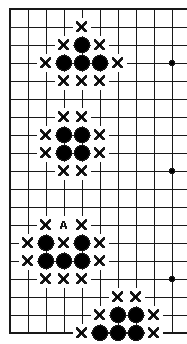

在棋盘上相连接的两个或两个以上的棋子，它们的气数取决于棋子排列的形式和棋子所处的位置。如图三：图中上方中腹的四子有八气，接下来方形排列的四个子是八气，下面中腹的五个子是十气，下边上的五个子是六气。

那么，下面中腹五子边上的A点为什么不算是棋子的气数呢？这是因为对于五个棋子来说：A点并没有与它们紧紧相邻，所以不能算成气数。

围棋毕竟是两个人的对局，在行棋过程中双方所下的棋子并不是距离很远，彼此留出空交叉点给对方作“气”，而是相互接触，彼此围攻，这样一来“气”数的计算就变得复杂了。那么，被对方包围的棋子怎样算“气”呢？

图四

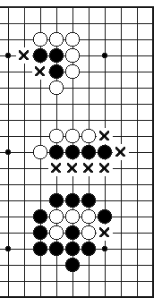

图四：图中上面的黑三子周围只有两个与它们紧紧相邻的空交叉点，所以只有两气。

图中间的黑四子周围有六个与它们紧紧相邻的空交叉点，所以它们有六气。

再看图中下面的五个白子，与它们紧紧相邻的交叉点几乎全被黑方占有，只留有一个空位算成它们的“气” 数，这样，白五子的“气”数为一“气”。

在对棋子的“气”有一定了解的前提下，就可以学习如何“吃子”了。

“吃子”作为围棋术语，也可称“提子”。在实战对局中，一方将另一方的一个或多个棋子紧紧包围，使其所有的气数被全部堵住（即其所有紧紧相邻的交叉点全部被占有），随后将无气的棋子从棋盘上拿掉，就叫“吃子”。

没有“气”的棋子是没有生命力的，也不允许在棋盘上存在，一旦棋盘上的棋子处于无气状态，即可提掉。

图五
 
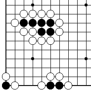

参考图

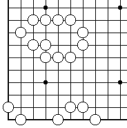
 

图五：图中的黑子不论是位于中腹、下边、还是左下角，它们都是没有“气”的子，都必须立即“提”出棋盘外。参考图就是棋子被提后所呈现的棋形。

没有“气”的棋子叫“死子”，也就是说，只有无“气”的“死子”才可以被提，棋盘上任何一个棋子，只要它还有一口“气”数，那它就依然可以放置在棋盘上。

图六

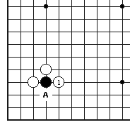

图六：当白1走过之后，黑一子仅余一口“气”，这时是不能将黑棋拿掉的，但白1却为提掉黑棋作了准备，只要白方下一着棋落在A位，那么黑一子即可被“提”。

在围棋中，我们把象白1这样的着子，即下子后把对方一子或若干棋子包围成仅剩一口“气”的状态，（如对方置之不理，再下一着即可将被围的棋子提取），称为“打”。通常也称为“打吃”。

“打”与“吃”是两个根本不同的概念，为了更多地区分它们，请集中看几个例子：

图七

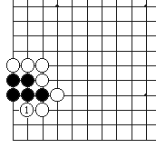

图八

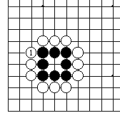

图九

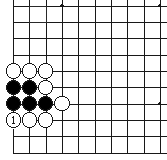

图十

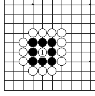
 

图七、八中的白1都是“打”的例子。

图九、十中的白1都是“吃”的例子。

有两种特殊的情况需要说明；一是如果在一方下子后出现了双方都无气的情况时，要由刚下子的一方将对方的无气棋子提掉，上面的图十就是这样。

图十一

(1)

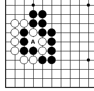
 
(2)

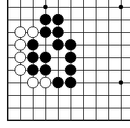

(3)

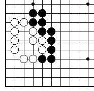
 

图十一：（1）图中的A位是黑白双方相争的要点，假若黑先放在A位，那么白三子将被提掉，见（2）图。反过来假若白先放在A位，则黑四子将被提掉。见（3）图，以上是黑白双方提子后的图形。

还有一种情况：对局的一方下过一手棋后并没有使对方的棋子被吃，反将自己的“气”数变为零，这时，行棋的一方要自动将自己无气的棋子提掉，然后该轮对方行棋（这是围棋规则的规定）。

图十二

(1)

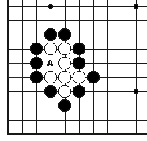

(2)

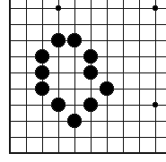

图十二：（1）图的白棋就是这种情况。假若白方将棋行在A位，则须立即将无气的白子自动提出棋盘。（2）图这是白方行在A位的结果，此后轮黑方行棋，这种情况对于白方来说也可叫“自拔”。

### 练习题

一、什么是棋子的“气”？下面图中的黑棋分别有多少气？

图一

图二

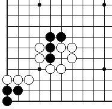

 

二、什么叫吃子？棋子在什么情况可以被提掉？图三中黑棋怎样提掉白子？图四中白棋怎样提掉黑子？

图三

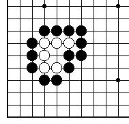

图四

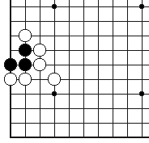

 

三、什么是打？指出“打”与“吃”的区别？
 

四、综合练习题

图五

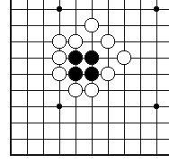
 
图六

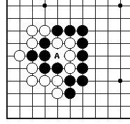

图五：白先怎样经过“打”与“吃”的过程将被包围的黑子提掉？

图六：为什么A点是黑白双方争夺的要点？

### 练习题答案

一、气：围棋术语之一。是指在棋盘上与棋子紧紧相邻的空交叉点。

图一解

图一解：角上的三子为四气。 左边上的两子为五气。中腹的五子为八气。
 

图二解

图二解：左下角黑三子的气数是两气，中腹黑四子为五气。
 

二、吃子：围棋术语之一。

也可称“提子”在实战对局中，一方将另一方的一个或多个棋子紧紧包围，使其所有的气数全部被占有，随后将无气的棋子从棋盘上拿掉，叫“吃子”。

棋子只有在无气的情况下才可以被提掉。

图三解

图三解：黑行棋可放在A位将六个白子提掉。
 
图四解

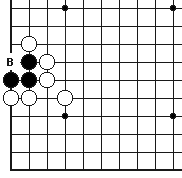
 
图四解：白先将棋下在B位，即可提去黑子。

三、“打”，当对局一方下子后把对方一子或者若干棋子包围成仅剩一口“气”的状态，如对方置之不理，再下一着即可将被围的棋子提取，这着棋称为“打”。

“打”与“吃”有本质的区别，“打”行在“吃”的前面，是吃掉对方棋子的先行步骤，“打”使对方棋子仅剩一口气，“吃”使对方棋子气数变为零，并随即提去。

四、图五解：白的行棋次序先在1位打，然后2位吃，再将黑四子提掉。

图五解

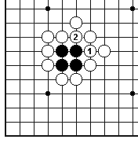
 
图六解

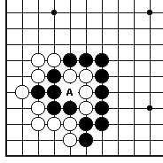
 

图六解：A点之所以是黑白双方争取的要点，是因为假如白方先占有A点，则可提掉黑五子，反过来，假若黑方占有A点，则白四子被吃。
 

## 第四课 不能“下子”的地方

初看这个题目有些奇怪。但围棋的规则规定有些地方是不能下子的，围棋术语也叫“禁着点”。那么，什么地方不让“下子”呢？由于各种规则的不同，这个问题较为复杂，而且还关系到劫材问题，有许多值得探讨的地方，作为初学者只要明白什么地方不应该下子便可以了。

凡是要下的棋子，周围没有气，又不能吃掉对方子的地方，都叫“禁着点”。从某种意义上说，下在此处不产生任何意义，却反而吃亏的地方，都叫“禁着点”。

图一

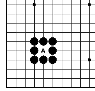

图一：八个黑子围住中间的一个交叉点（A点），在这个交叉点上下黑子就可以，而下白子则不可以，A点就是“禁着点”。
 
图二

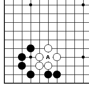

图二也是一样，在A点上下白子可以，而下黑子则不行，因为要下的子周围没有使之而生存的“气”。

图三

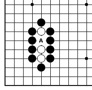
 

图三：A点白子不能下，下黑子可以吃掉白三子。

图四

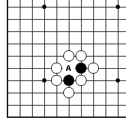

图四：此情况有些特别，黑方是不能下在A位的，这等于自杀或“自拔”，而白方下在A位，就可非常痛快地吃掉黑棋两个子。
所以说，“禁着点”是针对某一方来说的，等以后讲到“双活”的部分还要叙述，因为到那时，有的“交叉点”，谁也不能下，谁下谁吃亏。所谓“不能下”或“禁着点”的意义是相对的，作为对局的一方若在“禁着点”内下子，没有任何意义，或是吃亏或是受损。

 
图五

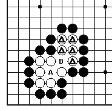

图五：这又是一个典型例子，在这个图形中虽超出了“不能下子的地方”的范围，但这个图形有讲解的必要。如图所示：B点若黑棋占领，白棋△五子就被吃掉了。所以B点是可以下子的。如果B点白棋占领，也是没有用的，黑方可以在A点把白方的所有棋子都吃掉，图五和图六讲的都是一个道理。

图六

 
在图五和图六中，虽然可以下子，不是“禁着点”，但对白方来说下子是没有用处的，只能是越下死的越多。

“禁着点”的含义清楚之后，对图七就可以判断了。许多初学围棋的人都时常犯一个共同的错误，即老是在别人提过自己的地方反复下子。

图七

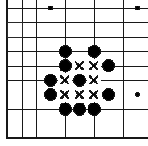

图七：白方在x点的任何部位下子虽不违反围棋的规则，但都是错误的，都只能被黑方无条件地“歼灭”。

图八

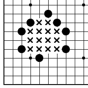

图九

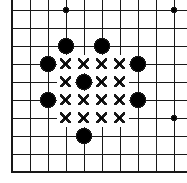

图八和图九也是一样，这种地方黑棋的势力十分强大，而围棋又是黑白双方轮流下子，所以有许多初学围棋的人老是期待别人看不见，或自己连走几步，把对方吃掉，这是不可能的，在这几个图里，x点虽不是“禁着点”，但下子没有意义。

前面已经讲过，凡是要下子的地方，若周围既没有气，又不能吃掉对方的子，那么，这就是围棋规则所规定的“不能下子的地方”，但如果能吃掉对方的子，虽然周围没有“气”，也是可以下的，不但能下，而且是“好棋”。
 
图十

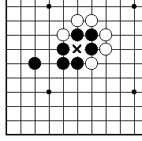

图十：若白方下在x点，虽然周围没有“气”，又都是黑子包围，但白方下在这里能吃掉黑方三个子，真是痛快淋漓的“好棋”。

图十一

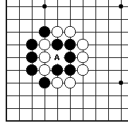

图十一：A点事关重大，这里非但不是“不能下子的地方”，而是双方必争的要点，A点被白方占领，黑方的五个黑子就被吃掉，假如被黑方占到A点，白方的三个白子，就被黑方吃掉。

图十二

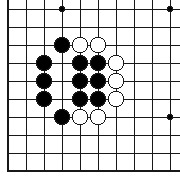

图十二：这是黑方吃掉白方三子后的图形，在十一图后，黑方占到了A位，成功地完成了围歼白方的战斗预想。

图十三

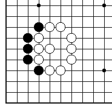

图十三：白方占据了A点，也同样吃掉了黑方五个子，所以这种情形与“禁着点”不同，这些例子都是区别一般的吃子技术和“禁着点”的形状，特此说明。

### 练 习 题

一、A点能下白子吗？为什么？

一题图

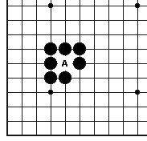

二、A点能下白子吗？为什么

二题图

三、A点能算做“禁着点”吗？为什么？

三题图

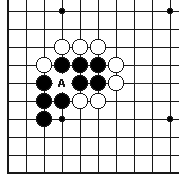

四、A点是“禁着点”吗？为什么？

四题图

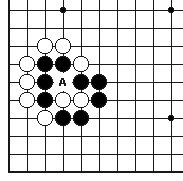

五、在这里（在7个有x的地方）下子虽然不违反规则，但有实际意义吗？

五题图

 

### 练习题答案

一、正解图

一题正解图

练习题中的A点的“禁着点”，是不允许在这里下子的，因为白方如在这里下子，既不能吃掉任何黑子，而本身又没有“气”，所以这里是不能下子的。

二、正解图

二题正解图

二题中的A点不能下白子，若白方在这里下子，等于“自杀”，这里没有生存的空间。所不同的是黑方如下在A点，将能吃掉白方一子，黑方可下，白不可下。

三、正解图

三题正解图

A点对于黑白双方都不是“禁着点”，若黑方占据，可救回危险的五子，若白方棋占据，就变成了正解图的形状，吃掉了黑五个子。

四、正解图

四题解答 A

四题解答 B

A点不但不是“禁着点”，而且是双方争夺的要害之处，如黑方争到这点，就可以吃掉白方两个子，确保自身的平安。见四题解答A。

在四题解答B中假如白方争到此点，就可以把黑方吃掉，而白方原来非常危险的二枚白子被救出，所以这一点非常重要的。

 

五、正解图

五题正解图

图中交叉点都是黑棋的势力，虽然不是“禁着点”，但在这里边下在任何一处的交叉点上对于黑棋都不会有威胁，而且是白白送死，下在这里没有意义。

 
## 第五课 眼与活棋

我们知道，棋子的“气”是棋子在棋盘上赖以生存的条件，一个子只要有气，就可以不被提去。一块棋假若有两个“眼”就能够永远在棋盘中生存、发展，属于这块棋的所有棋子都将作为“活子”对待。所以说，围棋艺术暗示着“生与死”的搏杀。

什么是“眼”呢？“眼”是围棋术语之一，也称“真眼”“整眼”，是指由多个棋子围住的一个或两个以上的空交叉点。

图一

图一：角上的三颗棋子围住的空交叉点就是“眼”，左边上五个子围住的空交叉点和中腹七个子围住的空叉点都是“眼”。

被围住的一个空交叉点都是“眼”被围住的两个或两个以上的空交叉点也叫“眼”。“眼”有大小之分，被围住的多个交叉点被称为“大眼”。

图二

图二：图中角上四子围成的两个空交叉点称为“一个眼”，上方中腹被围住的两个空交叉点和下边多个子围住的三个空交叉点都应该称为一个“眼”。

在认识“眼”的过程中，有一点需要注意：有一种被围住的空交叉点形状很象“眼”，但却不是“真眼”，如果仔细区分就可以发现它们的不同之处。

图三

如图三：角上的两个黑子围住的空交叉点看上去似“眼”，但却不能真正起到眼的作用，当白方行在A位“打吃”之后，黑方将要被吃也是这个道理。这样，空交叉点也就不复存在了。在图中的另一个例子中，A，B两点均没有黑子，那么，当白方将A、B两点完全占有时，C就不能称为“眼”了。

图四

看图四，黑方眼形被白方占据要害之处后，“眼”便消失了。 我们把这种象“眼”而又不是“眼”的形状叫做“假眼”。

图五

 
“假眼”是迟早将消失的“眼”形，如图五白1打，黑2接，眼形马上消失。

由多个棋子连接组合在一起的一块棋，假若有了两个眼，就可称作“活棋”，“活棋”是永远不可能被提掉的棋。

图六

图六：角上黑六个子围成A，B两眼，那么这黑六个子就是一块活棋，上方中腹十个子围成A，B两个眼，这块棋也是活棋。

图七

在角上，仅需六个子就可以围成两个眼，在边上最少需八个子，而在中腹则最少需十个子才能做到两眼（如图七）。

所以，一般情况下，在角上做眼所需子数量少，最易活棋，其次是边上，再次是中腹。

我们既然明白了两个“眼”以上的棋是活棋，那么在实际对局中，应该怎样应用呢？

图八

图八：被黑子围住的中间有三个相连的空交叉点。这是一个大眼。单纯的讲，这块棋的现状还不能说成是“活棋”，若想使它变成活棋，必须做成两个眼，或两个以上的眼。但是，怎样才能做成两个眼呢？

 
图九

 
图九：黑方必须在三个空交叉点的中间一点放一子使一个大眼变成两个眼，所放一子即黑1。

三个或三个以上的空交叉点组成的大眼一般可以做成两个或两个以上的眼。

图十

图十；看上去，这是一个由七个空交叉点组成的大眼，假若黑方在A位下一子，这块棋变成了两个眼，假若按着在B位下一子，这块棋就成三个眼，假若再接着在C位下一子，这块棋则变成了四个眼。

在实战中，一定要注意作“眼”，把棋作成活棋，防止对方攻击，当然一块棋虽然“眼”多没有坏处，但仅做两个眼也就已经够了。

图十一

 

有些时候，已方做眼的要点如被对方抢占到，则变成了死棋，图十一就是这样的例子，白方抢到了1位，这块棋只有一个眼，不是活棋。

图十二

图十三

 
还有些时候，一块棋的“眼”很大，只要在“大眼”中某一处放一子即可使棋变成两个眼，即使置之不理，也不会有生命危险。如图十二，被黑子围住的“大眼”共有五个空交叉点一字排开而成，假若不在其中的A,B,C某点做眼，对手也难以立即一下子把A、B、C、三点占领，就是白方占据A，B两点以后，黑方再于C位做眼也不迟，图十三就是白A、B之后黑于C位做眼的图形，白两子不起什么威胁作用。

在活棋中，有一种特殊的情况叫“双活”也称“共活”、“公活”，双方互围的棋子均无两个眼，形成彼此不能杀死对方的局面，双方都算活棋，称为“双活”。

图十四

图十四：在被围住的黑五子和白五子中间有两气，这两气叫“公气”任何一方假若先在公气落子，都将被对方杀死吃掉，双方都只能维持现状，共求生存。

图十五

图十五：这是共活的例子，被围的黑白双方都各有一个“眼”，中间有一口公气，谁先放进公气，谁将被对方吃掉，公活的例子除双活外，还有“三活”。

图十六

 
图十六：被外面黑子包围的两块白棋和一块黑棋中，两块白棋都各有一个眼和一口公气，两块棋被两个黑子隔开，两口公气位于两个黑子的两边，从而形成三块棋对峙的局面。A、B两点是任何一方也不能着子处。这种情况称“三活”。

 
依此类推，在实战中还可能出现“四活”，“五活”等等，不过，这种情况在实战中比较少见，所以不再一一详细例举。

图十七

 

基本活棋是大家目前必须掌握的，图十七的形状叫“直四”，它和前面的一些例子是常见的活形。其他一些稍复杂的棋形，将在以后的“死活”一节详述。
 
### 练习题

一、什么是眼？一题中三个例子哪个是假眼？哪个是真眼？为什么？

一题图
 

 
二、什么叫活棋？下面几个图中的棋，哪些是活的？哪些棋是死的？ 想一想为什么？

二题图 1

 
二题图 2

 
二题图 3
 

二题图 4

二题图 5

三、什么是双活？下面各图中哪种情况是双活？想一想，为什么？

三题图 1

三题图 2
 

三题图 3

 
### 练习题答案

一、眼：围棋术语之一，也称“真眼”，“整眼”。是指由多个棋子围住的一个或两个以上的空交叉点。

一题正解图

一题正解图中的三个例子，左下角的图和中腹的图都是假眼，左边的图形是真眼。

因为下角的图形要是被对方占有，眼形不完整，一旦白方从白1打黑子，那么黑只有接上，这样“眼”形也就消失了，所以是假眼。

白方若在中腹1位打，黑2位接，眼同样消失，所以是假眼。

只有左上边的眼形是完整的，所以是“真眼”。

二、活棋：永远不能被提掉的棋称“活棋”，活棋必须要有两个或两个以上的“眼”。在练习图1－图5中，图2是死棋，其余的图形都是活棋。

图1显然有两个完整的眼，所以是活棋。

二题图 2 解

 
图2解：右边的眼形不完整，是假眼，整个图形只有一个真眼，所以不是活棋。

图3解：图中的两个眼，每个眼都有两个交叉点构成，它们都是真眼，所以图3是活形。

二题图 4 解

图4解：黑棋的眼是四个空交叉点组成的大眼，无论放在A或B点都会使大眼成为两个眼，所以它是活棋。（如图）。

图5解：图中，黑方有完整的三个眼，是活棋。

三、双活是指：双方互围的棋子均无两个眼，形成彼此不能制杀的局面，双方都算活棋，称为“双活”也叫“公活”“共活”。

三题图 1 解

三题图1不是双活，因为被包围的白棋虽然有一个眼和一口外气，但黑棋却已经有了两个完整的眼，成为活棋，只要黑再放在A位“打”白棋，便把白棋置于死地，这块棋不是双活。

 
三题图2是双活，此时黑白双方都各有一眼和共有一口公气，所以是双活。

三题图 3 解

三题图3不是双活，因为图中虽有一口公气，但被包围的白棋外面的气数太多是三气，白方可以轻松地放在A位打黑棋。而后将其吃掉。
 

## 第六课 死棋

在围棋中，棋盘上的棋子有活棋和死棋之分，前一课讲了活棋，现在我们讲一讲死棋。

所谓死棋就是在对局过程中的一方的一块棋被对方的棋子包围住，被围的棋没有两个眼以供作活，也就是说，棋盘上任何一块棋到最后迟早总是要被对方提掉或终局时拿掉的棋子，称这为死棋（见图一）

图一中被白方包围的六个黑子没有两个以供活棋的“眼”位，所以是死棋。

图一

 

图二

 

死棋可以出现在棋盘的任何一个地方。如图二的角上为死棋，图三的边上为死棋和图四的中腹为死棋。

 

图三

 

图四

 

在对局中出现死棋可以将其提掉，也可以不提，而到了终局后再把死棋从棋盘上拿掉，以计算胜负。棋盘上的死棋是先提掉还是待终局时拿掉要视情况而定。如不提掉对方被围的棋子便威胁到已方的生存或使对方被围的棋逃脱，则应提掉对方的死棋，反之，等终局时拿掉就可以了（见图六）。

 

图五

 

图五：轮白先走，必须先提掉围住的黑四子，因为在白的包围圈外的黑四子对白棋吃黑四子有威胁，所以白方必须提掉黑的死棋。

 

 

 

 

 

图六

 

图六：白棋围住的黑四子可不必提掉，因为白子没有危险。

 

 

什么是死棋？下面介绍几种简单的死棋形式：

 

图七

 

一、棋子在对方包围中没有活力，也就是没有气的棋子。而这些棋子在对局中已被对方提掉了。如图七：被白包围的三个黑子周围没有气，被对方提掉了，所以黑三子是死棋。

 

 

 

 

 

图八

 

二、虽然棋子在棋盘上还有活力，还有气，但却被对方的棋子全部包围住，在对方的包围圈内无法做成活棋，也就是说做不出两个眼。这样也是死棋的一种形式（如图八）。
图八中被白包围的黑四子还有活力，也就是还有气；但黑棋在白的包围中没有以供做活的两只眼，所以黑四子是死棋。

 

 

 

 

图九

 

三、还有一种被围棋子有活力有气， 也有一个眼位，但不能做出可以活棋的第二个眼，也是死棋的一种常见形式（如图九）。
图九：被围的黑七子有一个眼位（A点），但在白方的包围圈中做不出第二个眼，所以黑七子是死棋。

 

 

 

 

还有一种形式，似乎有两个眼位，但实际上只有真实的一个眼或连一个真实的眼都没有（如图十、图十一）。

 

图十

 

图十：被包围的黑棋只有一个真实的眼（A点），而另一只看似眼位却不是一个真实的眼位（B点）。所以这块被围的黑棋是死棋。

 

 

 

 

 

图十一

 

图十一：被包围的的黑棋看似有两个眼位（A）但实际上A点中可以下子，待B点的气都被白棋占后，A点就可以被白棋下子提去，黑死棋（见图十二）。

 

 

 

 

 

图十二

图十二：白棋1、3、5、7依次把黑棋提掉了。黑即使在白1打时在3位粘也无用，因为白7位再打时黑又全死了。后果见图十三。

 

 

 

 

图十三

 

图十三：即使黑棋2、4两手全粘，但黑十一子还是全死了。

 

 > http://weiqi.sports.tom.com/secondary/wskt/rumen/images/006/spr_wq_rumen_006_03.htm

 
 

 

 